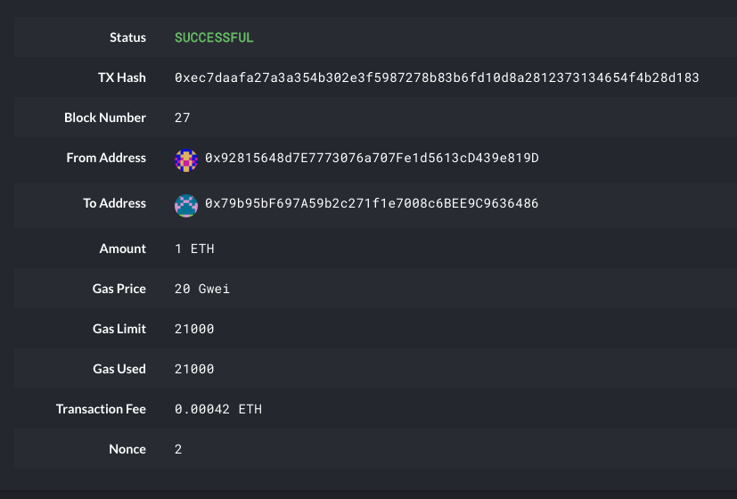

# Blockchain Homework
## Instructions

### Set-Up Overview
* blockchain: 'films'
* chain ID: '1989'
* Node Passwords: 'love'
* Nodes: 'party' and 'travel'

### The First Node 

1. Open a terminal window (Git Bash in Windows) navigate to your `Blockchain-Tools` folder and follow the next steps.


2. Launch the first node into mining mode with the following command:

 ```bash
 ./geth --datadir party --mine --minerthreads 1
 ```

 * The `--mine` flag tells the node to mine new blocks.

 * The `--minerthreads` flag tells `geth` how many CPU threads, or "workers" to use during mining. Since our difficulty is low, we can set it to 1.

* You should see the node `Committing new mining work` in the terminal.

3. Scroll up in the terminal window where `party` is running, and copy the entire `enode://` address (including the last `@address:port` segment) of the first node located in the `Started P2P Networking` line:

* This address to tell the second node where to find the first node.

### The Second Node

1. Open another terminal window and navigate to the same directory 'Blockchain-Tools'.

2.  Launch the second node, enable RPC, change the sync port, and pass the `enode://` address of the first node in quotes by running the following command (it will differ in Windows and OS X):
 ```bash
 ./geth --datadir travel --port 30304 --rpc --bootnodes "enode://<replace with node1 enode address>"
 ```

## Connecting to MyCrypto

### Accessing Wallet Funding

1. Open up MyCrypto to get the private key of the ETH address that has funds available. Be sure the `Kovan` network is selected.

2. Unlock your wallet using your mnemonic phrase.

3. Select the ETH address you use to fund your chain, and in the 'Select' dropdown list or header ribbon, choose 'Wallet Info.'

4. Click on the eye icon next to the 'Private Key' field, and copy and paste the private key of the wallet in a safe place to access later.

### Connecting to your Network

1. Click `Change Network` at the bottom left.

2. Click "Add Custom Node", then add the custom network information that you set in the genesis.

* Make sure that you scroll down to choose `Custom` in the "Network" column to reveal more options like `Chain ID`: 
* The chain ID must match our 'Chain ID' which is '1989'.
* The URL is pointing to the default RPC port on your local machine. Use `http://127.0.0.1:8545`.

### Transacting

1. On the left pane menu, click on `View & Send`.
2. Select the `Private Key` option.
3. Paste in your private key from step 4 of `Accessing Wallet Funding`.
4. Select  `Send Ether & Tokens` from drop down or header ribbon.
5. Fillout the form including the address you'll be sending, the ammount of ether, and the fee. 
* Ensure that between your fee and amount you do not exceed your balance. 
6. Click the `Check TX Status` on the green message and confirm logout.
7. You should see the trasaction go from `Pending` to `Successful` in around the same block time you set in the genesis.

* You can click the `Check TX Status` button to update the status.



